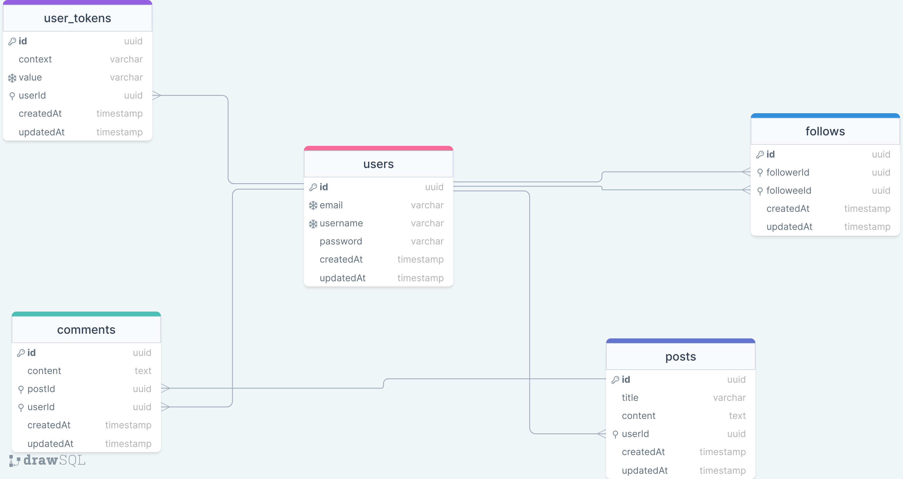

# Raddit API

API for a social blogging application.

## Tech

- Node
- TypeScript
- Nest
- Knex
- Postgres
- Jest

## Features

- Auth (register, login, logout, logout from all devices)
- Posts
- Comments
- Follow/Unfollow
- Personal feed

## Database schema



## Getting started

Clone the repo and install dependencies

```
$ git clone https://github.com/ntson/raddit-api.git
$ cd raddit-api
$ npm install
```

Make sure to check the `src/config/knexfile.ts` and create the development and testing databases.

Create the `.env` file at the project root following the `.env.example` file.

Run database migration

```
$ npm run db:migrate:local
```

Start the development server

```
$ npm run dev
```

Run the test

```
$ npm test
```

Build the app

```
$ npm run build
```

Start the production server

```
$ npm start
```
